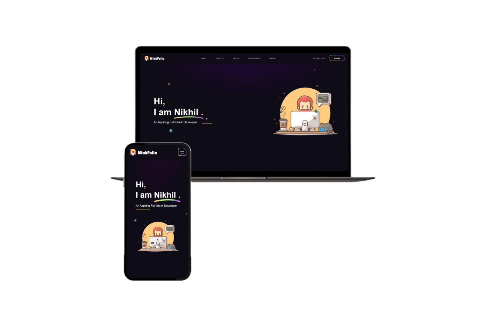

<h2 align="center">
  NickFolio - v1.0  
  <a href="https://nickfolio.vercel.app/" target="_blank">NikhilGholap1304</a>
</h2>

  

 

 &nbsp;
 &nbsp;
 &nbsp;
 &nbsp;

<h3 align="center">
    ☢
    <a href="https://github.com/Nikhilgholap1304/NickFolio/issues">Report Bug</a> &nbsp; &nbsp;
    ✨
    <a href="https://github.com/Nikhilgholap1304/NickFolio/issues">Request Feature</a>
</h3>

## TL;DR

You can fork this repo to modify and make changes of your own. Please give me proper credit by linking back to [NikhilGholap1304](https://github.com/Nikhilgholap1304/NickFolio). Thanks!

## Built With

My personal portfolio <a href="https://nickfolio.vercel.app/" target="_blank">NickFolio</a> which features my personal details, contact medium, some of my github projects as well as my resume and technical skills. 

This project was built using these technologies.

- React.js
- Vite.js
- Node.js
- Tailwind
- Framer-Motion
- SCSS
- VsCode
- IDX
- Vercel

## Features

**🌘 Stuffed with Modern UI uniquely based on Space Theme**

**🎨 Styled with React-Tailwind**

**🎗 Upto the Mark Animation**

**🥽 Intuitive Parallax Effect**

**🚟 Horizontal Scroll Effect**

**📱 Fully Responsive**

**... And many more, just try to explore !**

## Getting Started

Clone down this repository. You will need `node.js` and `git` installed globally on your machine.

## 🛠 Installation and Setup Instructions

1. Installation: `npm install`

2. In the project directory, you can run: `npm run dev`

Runs the app in the development mode.\
Open [http://localhost:5173](http://localhost:5173) to view it in the browser.
The page will reload if you make edits.

## Usage Instructions

Open the project folder and Navigate to `/src/components/`.  
You will find all the components used and you can edit your information accordingly.

### Show your support

Give a ⭐ if you like this website!
